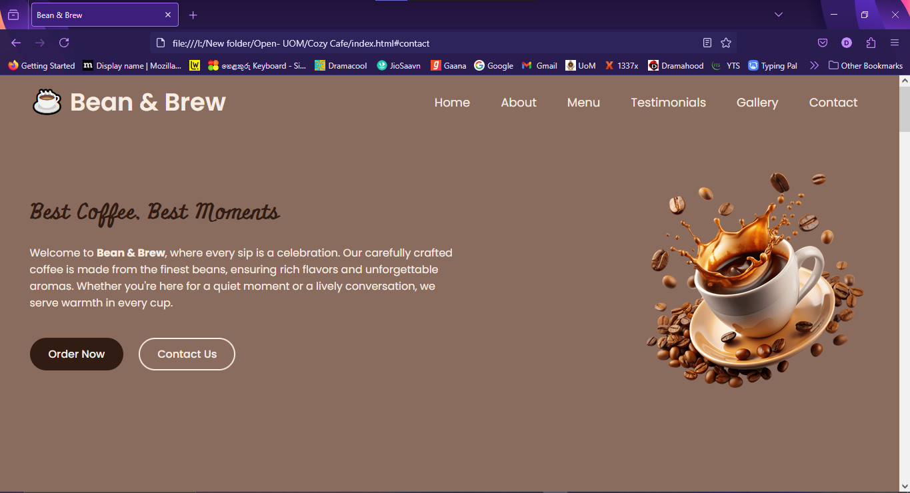

# ☕ Bean & Brew – Coffee Shop Website Project

This is a responsive and visually engaging coffee shop website concept built for practice and fun. It features smooth user interactions, cozy visuals, and a layout that adapts to all screen sizes.

---

## 📑Table of Contents

- [Overview](#overview)
  - [🎯The Project](#🎯the-project)
  - [📸Screenshot](#📸screenshot)
  - [🔗Links](#🔗links)
- [My Process](#my-process)
  - [🛠Built with](#🛠built-with)
  - [📚What I Learned](#📚what-i-learned)
  - [🚀Continued Development](#🚀continued-development)
  - [🔎Useful Resources](#🔎useful-resources)
- [👩‍💻Author](#👩‍💻author)
- [🙏Acknowledgements](#🙏acknowledgements)

---

## 🔍Overview

### 🎯The Project

Users should be able to:
- Navigate through multiple sections like Home, About, Menu, Gallery, and Contact
- View interactive elements with hover states
- Enjoy a mobile-friendly, responsive layout
- Experience a simple Swiper slider for testimonials

### 📸Screenshot

### 🔗Links

- 🔴 **Live Site URL**: [https://bean-brew.netlify.app/](https://bean-brew.netlify.app/)
- 🟣 **GitHub Repository**: [https://github.com/dulaagamage/Bean-Brew](https://github.com/dulaagamage/Bean-Brew)

---

## ⚙️My Process

### 🛠Built with

- Semantic **HTML5**
- Custom **CSS3** (Mobile-first)
- **Vanilla JavaScript**
- **SwiperJS** (for the testimonials slider)
- **Font Awesome Icons**
- 💻 VS Code + Live Server

### 📚What I Learned

This project gave me hands-on practice in:

- Writing cleaner, modular HTML & CSS
- Improving responsive design with Flexbox and media queries
- Integrating SwiperJS for dynamic content sliders
- Designing an aesthetically pleasing and accessible layout
- Structuring a small multi-section site with scrollable anchors

### 🚀Continued Development

Future ideas and upgrades:
- Add form validation for the contact section
- Optimize assets and lazy-load images
- Add dark mode toggle with JavaScript

### 🔎Useful Resources

- 📘 [SwiperJS Docs](https://swiperjs.com/) – For adding the sliding testimonials
- 🌐 [Font Awesome](https://fontawesome.com/) – To make my icons ✨iconic✨
- 🧠 [MDN Web Docs](https://developer.mozilla.org/) – My go-to for HTML, CSS, and JS

---

## 👩‍💻Author

- GitHub – [@dulaagamage](https://github.com/dulaagamage)
- LinkedIn – [Dulanjalee Gamage](https://www.linkedin.com/in/dulanjalee-gamage-01a7aa207/)
- Email – dulaagamage123@gmail.com

---

## 🙏Acknowledgements

Shoutout to the vibes of every cozy coffee shop I’ve ever sat in while dreaming up code ☕❤️  
Thanks to the OUSL & UOM lecturers for inspiring structured learning and clean UI design.

---
